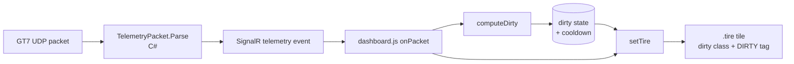

# Requirements

### Overview & Goals
Add a per-tire **dirty** indicator to the TIRE TEMPERATURE panel of the GT7 dashboard. GT7 doesn't publish an explicit "dirty" flag, so the state is inferred client-side from telemetry the game already sends (wheel speeds, tire radii, ground speed, `CarOnTrack` flag).

### Scope
**In scope**
- Client-side heuristic in `wwwroot/dashboard.js` that produces a per-wheel `isDirty` boolean.
- A short cooldown (~2 s) after the condition ends so the badge doesn't flicker.
- Visual state on each `.tire` tile in `wwwroot/index.html` and `wwwroot/styles.css`: brown/mud tint on the tile border and box-shadow, plus a small `DIRTY` tag next to the temperature.

**Out of scope**
- Server-side changes to `TelemetryPacket`, the SignalR hub, or the smoke test.
- Parsing new byte offsets in the encrypted GT7 packet.
- "Grip level" or "time-off-track" metrics beyond the dirty flag itself.
- Persisting or historising the dirty state.

### User Stories
- **As a driver watching the dashboard**, I want each tire tile to clearly show when that tire has run off the tarmac (grass/gravel/dirt), so I know why grip has dropped and roughly how long the effect will last.
- **As a viewer/streamer**, I want the dirty indicator to be visually unmistakable but still keep the current temperature reading visible.

### Functional Requirements
- Each of the four tire tiles (`tire-fl`, `tire-fr`, `tire-rl`, `tire-rr`) gains an optional `dirty` state.
- When active, the tile shows:
  - A brown-tinted border and inner box-shadow overlaid on top of the existing `cold`/`optimal`/`warm`/`hot` colouring (temperature stays readable).
  - A small `DIRTY` badge next to the temperature value.
- The state is set when the heuristic (see Technical Design) fires, and cleared after a cooldown once conditions return to normal.
- The dirty state must not appear during normal driving on tarmac (no false positives from ordinary wheelspin off the line or from ABS lockups).
- The state is derived entirely in the browser; refreshing the page starts from a clean state.

### Non-Functional Requirements
- No visible impact on the existing ~30 Hz UI refresh — the heuristic runs inside the existing `onPacket` handler.
- No new dependencies or bundle changes.
- Behaviour is identical in **simulator** and **live UDP** modes (the simulator currently doesn't produce off-track packets, so the badge simply stays off — that's acceptable).

# Technical Design

### Current Implementation
- The packet parser `src/GranTurismoTelemetry.Web/Gt7/TelemetryPacket.cs` decodes tire temperatures (`TireTempFL/FR/RL/RR` at offsets `0x60..0x6C`), wheel angular speeds in rad/s (`WheelSpeedFL/FR/RL/RR` at `0xB4..0xC0`), tire radii in metres (`TireRadiusFL/FR/RL/RR` at `0xC4..0xD0`), ground speed (`SpeedMps` at `0x4C`), and the `CarOnTrack` bit of `SimulatorFlags` (bit 0). None of these are currently used to derive an off-track signal.
- The tire tiles are declared in `src/GranTurismoTelemetry.Web/wwwroot/index.html` (`<section class="panel tires">`, tiles `tire-fl` … `tire-rr`, each with a `.tag` and `.temp` span).
- Visual state is applied client-side in `src/GranTurismoTelemetry.Web/wwwroot/dashboard.js` by `setTire(node, temp)` which toggles `cold`/`optimal`/`warm`/`hot` classes on the tile. `wwwroot/styles.css` (lines ~186–201) defines those band classes.
- The dashboard already keeps small pieces of per-frame state on module-scope variables (`smoothRpm`, `smoothSpeed`, `redlineRpm`, `shiftBeginRpm`). Adding one more small state object follows the same convention.

### Key Decisions
- **Detect on the client, not on the server.** Every other derived value in the app (tire temperature bands, RPM smoothing/shift lights, km/h ↔ mph, connection staleness) is computed in `dashboard.js`. Keeping the heuristic there preserves that pattern and avoids changing the SignalR contract or the smoke test.
- **Heuristic combines a strong signal with a weak one.** The strong signal is the game's own `CarOnTrack` flag (bit 0 of `SimulatorFlags`): when it clears, we're off-track. The weak signal is per-wheel *tangential speed vs. ground speed* — a tire whose linear speed diverges from `speedMps` by more than a threshold for several consecutive frames is likely on low-grip terrain even if `CarOnTrack` is still set. Using both keeps false positives low.
- **Sticky cooldown, not instantaneous toggle.** Once a wheel is flagged dirty, it stays dirty for `DIRTY_COOLDOWN_MS ≈ 2000 ms` after the condition ends. This matches how tires realistically stay caked for a few seconds after a grass excursion and prevents flicker.
- **Additive CSS class, not a replacement class.** The `dirty` class is applied *in addition to* the existing `cold`/`optimal`/`warm`/`hot` classes, so the temperature-based colour band is still visible underneath the brown overlay.

### Proposed Changes
1. **Markup (`index.html`)** — inside each `.tire` tile, add a hidden `<span class="dirty-tag">DIRTY</span>` element so the badge slot exists in the DOM up front. No layout change when it's hidden.
2. **CSS (`styles.css`)** — add a `.tire.dirty` rule (brown border + inset brown box-shadow, layered over the existing band shadows) and a `.tire.dirty .dirty-tag` rule to reveal the badge; keep the badge hidden by default with `.dirty-tag { display: none; }`.
3. **JS (`dashboard.js`)**:
   - Add module-scope state `const dirty = { fl: 0, fr: 0, rl: 0, rr: 0 }` storing the wall-clock timestamp at which each wheel's dirty flag expires (`0` = not dirty).
   - Add constants `FLAG_ON_TRACK` (already present), `DIRTY_SLIP_THRESHOLD = 0.25`, `DIRTY_MIN_SPEED_MPS = 5`, `DIRTY_COOLDOWN_MS = 2000`.
   - Add a helper `computeDirty(p, now)` that updates the four timestamps based on the heuristic below.
   - In `onPacket`, call `computeDirty(p, Date.now())` before the tire block, and change `setTire(el.tireFL, p.tireTempFL)` calls to `setTire(el.tireFL, p.tireTempFL, now < dirty.fl)` (etc.).
   - Extend `setTire(node, temp, isDirty)` to toggle the `dirty` class alongside the existing band classes.

### Data Models / Contracts
No change to `TelemetryPacket`, `TelemetryHub`, or `/api/telemetry/*`. The heuristic operates purely on the JSON that the SignalR `telemetry` event already delivers, using these existing fields:

 JS field           | Source                                | Used for                                    |
--------------------|---------------------------------------|---------------------------------------------|
 `p.speedMps`       | `TelemetryPacket.SpeedMps`            | ground speed reference                      |
 `p.wheelSpeedFL..RR` | `TelemetryPacket.WheelSpeedFL..RR`  | wheel angular velocity (rad/s)              |
 `p.tireRadiusFL..RR` | `TelemetryPacket.TireRadiusFL..RR`  | convert angular → linear wheel speed        |
 `p.flags`          | `TelemetryPacket.Flags` (ushort)      | `FLAG_ON_TRACK` bit for strong off-track signal |

Pseudocode for the heuristic:

```js
function computeDirty(p, now) {
    const v = p.speedMps || 0;
    const offTrack = (p.flags & FLAG_ON_TRACK) === 0;
    const wheels = [
        ["fl", p.wheelSpeedFL, p.tireRadiusFL],
        ["fr", p.wheelSpeedFR, p.tireRadiusFR],
        ["rl", p.wheelSpeedRL, p.tireRadiusRL],
        ["rr", p.wheelSpeedRR, p.tireRadiusRR],
    ];
    for (const [key, w, r] of wheels) {
        const wheelLin = (w || 0) * (r || 0);           // m/s
        const slip = Math.abs(v) < DIRTY_MIN_SPEED_MPS
            ? 0
            : Math.abs(wheelLin - v) / Math.abs(v);
        const triggered = offTrack || slip > DIRTY_SLIP_THRESHOLD;
        if (triggered) dirty[key] = now + DIRTY_COOLDOWN_MS;
    }
}
```

### Components
- **`.tire` tile** (`wwwroot/index.html`): existing component, gains a hidden `.dirty-tag` child span.
- **`setTire()`** (`wwwroot/dashboard.js`): existing helper, gains an `isDirty` parameter and toggles a `dirty` class.
- **`computeDirty()`** (`wwwroot/dashboard.js`, new): pure function of packet + timestamp that updates the module-scope `dirty` state object.
- **`.tire.dirty` / `.tire .dirty-tag`** (`wwwroot/styles.css`): new visual rules, layered on top of existing `.cold`/`.optimal`/`.warm`/`.hot`.

### File Structure
Only three existing files are touched — no new files:

- `src/GranTurismoTelemetry.Web/wwwroot/index.html` — add `<span class="dirty-tag">DIRTY</span>` inside each of the four `.tire` tiles.
- `src/GranTurismoTelemetry.Web/wwwroot/styles.css` — add `.tire.dirty` and `.tire .dirty-tag` rules near the existing tire block (~lines 186–201).
- `src/GranTurismoTelemetry.Web/wwwroot/dashboard.js` — add `dirty` state object, `computeDirty()` helper, and extend `setTire()` + its callsites.

### Architecture Diagram



### Risks
- **False positives from ordinary wheelspin off the line or during ABS lockups.** Mitigated by requiring `speedMps` above `DIRTY_MIN_SPEED_MPS` (5 m/s ≈ 18 km/h) before the slip branch of the heuristic fires; the `CarOnTrack` branch does not have this minimum.
- **False negatives when GT7 keeps `CarOnTrack` set on runoff areas.** Acceptable — the slip branch catches the more egregious cases; users can still see grip loss via the existing temperature drop.
- **Simulator never triggers the flag.** By design — `TelemetrySimulator.cs` currently doesn't emit realistic wheel-speed vs. ground-speed divergence, so the badge simply stays off in simulator mode. Not a regression.

# Testing

### Validation Approach
The change is UI-only and runs in the browser, so verification is done by observing the dashboard against the existing simulator and (optionally) a crafted packet, then confirming the badge appears/disappears as designed.

### Key Scenarios
- **Normal tarmac driving (simulator mode).** Launch with `dotnet run --project src\GranTurismoTelemetry.Web` and open <http://localhost:5080>. Confirm that no tire tile shows the `DIRTY` badge or brown overlay at any point during the simulated lap. Existing `cold`/`optimal`/`warm`/`hot` colours behave exactly as before.
- **Off-track flag.** In the browser devtools console, run a snippet that dispatches a fake packet with `flags & FLAG_ON_TRACK === 0` and verify all four tiles turn dirty within one frame and clear ~2 s after the flag returns.
- **Single-wheel slip.** Same trick, but only `wheelSpeedFL * tireRadiusFL` diverges from `speedMps` (e.g. wheel speed = 2 × ground speed) while `speedMps > 5`. Only the FL tile should turn dirty; the other three stay clean.

### Edge Cases
- **Very low speed** (`speedMps < 5`): the slip branch must not fire (division blow-up / stationary noise). Verified by parking the simulator (edit `TelemetrySimulator` throttle to 0 or wait for the braking phase) and confirming no dirty flags appear.
- **Missing fields**: some packets may have `wheelSpeedXX` or `tireRadiusXX` reported as 0 (early frames). The heuristic must treat them as "no slip" rather than infinite slip. Verified by reloading the page and confirming no flash of DIRTY during the first few packets.
- **Cooldown correctness**: after the condition clears, the badge must remain visible for ~2 s and then disappear. Verified with a devtools packet that briefly flips `FLAG_ON_TRACK` off then back on.

### Test Changes
No changes to `tests/GranTurismoTelemetry.SmokeTest/Program.cs` — the smoke test asserts on decoded packet fields, none of which change. The dirty-tire heuristic lives entirely in the browser and is outside the smoke test's remit.

# Delivery Steps

### ✓ Step 1: Add tire tile markup slot and CSS for the DIRTY state
The four tire tiles carry a hidden `DIRTY` badge slot, and a `.tire.dirty` visual style is defined so applying the class produces a brown overlay plus a visible badge — with no runtime toggling yet.

- In `src/GranTurismoTelemetry.Web/wwwroot/index.html`, inside each of `#tire-fl`, `#tire-fr`, `#tire-rl`, `#tire-rr`, add `<span class="dirty-tag">DIRTY</span>` alongside the existing `.tag` and `.temp` spans.
- In `src/GranTurismoTelemetry.Web/wwwroot/styles.css`, near the existing `.tire.cold / .optimal / .warm / .hot` rules (~lines 186–201):
  - Add `.tire .dirty-tag { display: none; }` so the badge is hidden by default.
  - Add `.tire.dirty` with a brown border colour (e.g. `#7a4a1c`) and an inset brown box-shadow layered over the existing band shadows.
  - Add `.tire.dirty .dirty-tag { display: inline-block; ... }` with a small pill style (padding, uppercase, monospace, mud/brown background) so the badge sits next to the temperature.
- Verify by temporarily hard-coding `class="tire dirty optimal"` on one tile in `index.html` and reloading the page: the overlay + badge must appear on top of the optimal (green) colouring; then revert.

### ✓ Step 2: Implement the off-track / wheel-slip heuristic in dashboard.js
`dashboard.js` produces a per-wheel `isDirty` boolean based on `flags & FLAG_ON_TRACK` and per-wheel slip, with a sticky cooldown so the state doesn't flicker.

- Add module-scope state near the existing `smoothRpm`/`smoothSpeed`: `const dirty = { fl: 0, fr: 0, rl: 0, rr: 0 };` where each value is the wall-clock timestamp at which the flag expires (`0` = not dirty).
- Add constants near the existing thresholds: `const DIRTY_SLIP_THRESHOLD = 0.25;`, `const DIRTY_MIN_SPEED_MPS = 5;`, `const DIRTY_COOLDOWN_MS = 2000;`.
- Add a helper `function computeDirty(p, now)` that:
  - Reads `p.speedMps` and `offTrack = (p.flags & FLAG_ON_TRACK) === 0`.
  - For each wheel `[key, w, r]` in `[["fl", p.wheelSpeedFL, p.tireRadiusFL], ...]`, computes `wheelLin = (w||0) * (r||0)`.
  - Computes `slip = Math.abs(p.speedMps) < DIRTY_MIN_SPEED_MPS ? 0 : Math.abs(wheelLin - p.speedMps) / Math.abs(p.speedMps)`.
  - If `offTrack || slip > DIRTY_SLIP_THRESHOLD`, sets `dirty[key] = now + DIRTY_COOLDOWN_MS`.
- Call `computeDirty(p, Date.now())` at the start of the `// ---- Tires ----` block inside `onPacket`.
- Do not touch the packet contract, SignalR handlers, or the smoke test.

### ✓ Step 3: Render the dirty state on each tire tile
`setTire()` toggles the `dirty` class on each tile based on the heuristic, so the brown overlay and `DIRTY` badge appear/disappear live as telemetry flows.

- Change the signature of `setTire(node, temp)` to `setTire(node, temp, isDirty)` in `dashboard.js`.
- Inside `setTire`, in addition to the existing `remove("cold", "optimal", "warm", "hot")` / band-add logic, add `node.classList.toggle("dirty", !!isDirty)` after the band classification.
- Update the four callsites in `onPacket` to pass the current dirty state:
  - `const now = Date.now();`
  - `setTire(el.tireFL, p.tireTempFL, now < dirty.fl);`
  - `setTire(el.tireFR, p.tireTempFR, now < dirty.fr);`
  - `setTire(el.tireRL, p.tireTempRL, now < dirty.rl);`
  - `setTire(el.tireRR, p.tireTempRR, now < dirty.rr);`
- Verify in the browser:
  - Simulator mode → no tile shows dirty (baseline unchanged).
  - Devtools console: manually invoke `computeDirty({flags: 0, speedMps: 20, wheelSpeedFL: 40, tireRadiusFL: 0.3, ...}, Date.now())` then wait for the next packet — all tiles turn dirty; ~2 s after conditions clear, badges disappear.

### ✓ Step 4: Drive the DIRTY state from the simulator so it's visible without a PS5
Follow-up scope change requested by the user: the badge must also appear in simulator mode. Update `TelemetrySimulator.cs` to emit realistic per-wheel telemetry (so the JS heuristic has valid inputs) and stage a scripted off-track excursion once per lap so all four tiles visibly turn brown, then clear ~2 s after the car "returns to track".

- Populate `TireRadiusFL/FR/RL/RR = 0.33f` (a realistic road-car radius) on every emitted packet so the JS `wheelLin = w * r` calculation isn't zero.
- Populate `WheelSpeedFL/FR/RL/RR` (rad/s) as `speedMps / TireRadius` so that during normal driving the per-wheel tangential speed matches `SpeedMps` exactly and the slip branch stays quiet (no false dirty flags on clean laps).
- Add a per-lap off-track window (e.g. `t ∈ [0.70, 0.76]` of the lap, ~3.6 s): clear the `SimulatorFlags.CarOnTrack` bit for those packets. The JS heuristic will then set all four `dirty[key]` cooldowns; when the flag returns, the tiles stay brown for ~2 s and then clear — which also demonstrates the cooldown.
- Do not touch the JS heuristic, the packet parser, the SignalR contract, or the smoke test.
- Verify by launching `dotnet run --project src\GranTurismoTelemetry.Web`, opening <http://localhost:5080>, and watching one lap: no dirty state during normal driving; all four tiles turn brown during the scripted excursion and clear ~2 s after it ends.