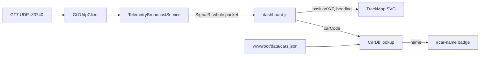

# Requirements

### Overview & Goals
Add two new pieces of information to the live GT7 dashboard using data that the parser already extracts but the UI does not yet show:

1. A **live track map** that auto-draws the circuit from the car's world position and shows the car as a moving dot.
2. A **car name badge** in the header, resolved from the numeric `CarCode` via a bundled JSON lookup table.

Both features are 100% client-side rendering — no protocol or network changes required. `PositionX/Y/Z` and `CarCode` are already parsed in `Gt7/TelemetryPacket.cs` and already flow to the browser through the existing SignalR broadcast in `Services/TelemetryBroadcastService.cs` (which sends the whole `TelemetryPacket` object).

### Scope

**In scope**
- New `#track-map` widget (SVG or `<canvas>`) in `wwwroot/index.html`, wired up in `wwwroot/dashboard.js`, styled in `wwwroot/styles.css`.
- Auto-trace the track outline from the last N minutes of `PositionX`/`PositionZ` samples (with world-space `Y` used only for elevation coloring if we want; primary map is top-down).
- Auto-fit the map to the observed position bounds; expand bounds as the driver explores.
- Live car dot with correct heading (using existing `Heading` field) and a fading recent-trail.
- Reset control (button + auto-reset on "paused→driving" transition or on a large teleport, e.g. car respawn).
- Header "car name" badge next to the existing session/status cluster.
- Bundled `wwwroot/data/cars.json` mapping `CarCode` → friendly name (make + model + optional PP). Ships with a starter subset; unknown codes fall back to `#<CarCode>`.
- Optional in-app override: a small note near the badge saying "unknown car code — contribute at…" pointing at the JSON file.

**Out of scope**
- Persisting the track map across sessions or reload (in-memory only).
- Track *identification* by name (e.g. "Suzuka"). We only show the shape.
- Server-side changes to the SignalR payload; the packet already carries the needed fields.
- Editor for the car database (users edit `cars.json` by hand or PR).

### User Stories
- *As a driver*, I want to see the shape of the track I'm on and my car's position on it, so I have spatial context beyond the numbers.
- *As a streamer*, I want a small map overlay so viewers can see the driver's location on the circuit.
- *As a driver*, I want the dashboard to name the car I'm driving so screenshots and recordings are self-documenting.

### Functional Requirements
- The map widget occupies a defined slot in the dashboard grid; on narrow viewports it collapses gracefully (like existing tiles).
- The map draws the trail using an accumulating set of `(PositionX, PositionZ)` samples, sub-sampled so drawing stays cheap (e.g. keep at most ~2000 points; drop duplicates within N metres).
- The car dot rotates to match `Heading` (radians) and is visually distinct from the trail.
- The map auto-fits: after each new sample outside the current bounds, expand the viewBox with a small padding margin; do not zoom in/out constantly for tiny movements.
- If `Flags.CarOnTrack` becomes false for more than ~5 seconds, or `PacketId` resets, the map does *not* draw wild connector lines — it should break the trail (skip a segment) on large jumps.
- The car-name badge shows the resolved name or `Car #<CarCode>` if unknown.
- The badge tooltip (`title=`) includes the raw `CarCode` for debugging.
- Toggling the existing km/h↔mph unit switch must not affect the map or badge.

### Non-Functional Requirements
- Rendering must keep the existing ~30 Hz update rate without dropped frames on a mid-range laptop. Redraw only when a new packet arrives.
- No new external dependencies (no map library); use plain SVG or Canvas 2D.
- `cars.json` is <100 KB when bundled, cached by the browser.

# Technical Design

### Current Implementation
- `Gt7/TelemetryPacket.cs` already parses `PositionX/Y/Z` (offsets 0x04/0x08/0x0C), `Heading` (0x28), `CarCode` (0x124..0x128) and the `SimulatorFlags` bit field.
- `Services/TelemetryBroadcastService.cs` sends the *entire* `TelemetryPacket` record to SignalR clients (`_hub.Clients.All.SendAsync(TelemetryHub.EventName, p, …)`), so every field is already visible in the browser payload — no server-side change is required.
- `wwwroot/dashboard.js` is a plain-JS SignalR client that maintains a smoothed view-model and renders it to DOM/SVG. `wwwroot/index.html` uses a CSS grid of tiles. `wwwroot/styles.css` provides the dark racing theme.
- `TelemetrySimulator.cs` produces synthetic data but currently doesn't animate `PositionX/Z` around a loop — for a good map demo it will benefit from a simple parametric "figure 8" or ellipse.

### Key Decisions
1. **Rendering**: use **SVG** for the track map. Rationale: matches the existing SVG RPM arc code style in `dashboard.js`; declarative; easy `viewBox` auto-fit; no `requestAnimationFrame` loop needed; car dot is a simple `<g transform>`.
2. **Coordinate system**: use `PositionX` as map-x and `PositionZ` as map-y (GT7's world space is XZ-horizontal, Y-up). Invert one axis so "north" points up if desired.
3. **Sampling policy**: keep an array of `{x, z}` capped at 2000 entries; only append if Euclidean distance from the last kept point is >= ~2 m; on overflow, drop from the head (FIFO). This keeps the polyline light and lets the trace "forget" old wrong-way excursions after ~one lap.
4. **Discontinuity handling**: when the delta from the previous sample exceeds a threshold (~100 m at 30 Hz → 3000 m/s, which is impossible), start a new SVG `polyline` segment instead of connecting them.
5. **Auto-fit**: track live `minX,maxX,minZ,maxZ` bounds; update the `<svg viewBox>` when a new sample exceeds bounds by more than a padding margin. Do not shrink bounds — only grow — so the map settles after ~one full lap.
6. **Car database**: bundle a static `wwwroot/data/cars.json` with `{ "<carCode>": { "name": "…", "maker": "…", "pp": 000 } }`. Fetch once on page load; keep in memory.
7. **No server changes**: everything is client-only. No new hub method, no new REST endpoint. Confirmed by inspecting `TelemetryBroadcastService.cs` which forwards the raw `TelemetryPacket` object.

### Proposed Changes
1. **`wwwroot/data/cars.json`** *(new)* — starter dataset of common GT7 `CarCode` → name mappings (e.g. 3298 = Mazda Roadster S ‘15, etc.). Seed with ~50–100 popular cars; users can extend.
2. **`wwwroot/index.html`**:
   - Add a new tile with `<svg id="track-map" ...>` inside a `.tile` container in the grid (place near the tire cluster / lap panel).
   - Add a `<button id="track-map-reset">reset map</button>` inside the tile header.
   - Add a `<span id="car-name">Car…</span>` badge in the existing header cluster.
3. **`wwwroot/dashboard.js`**:
   - Add a `TrackMap` module: internal state `{ points: [], segments: [[...]], bounds, dropped }`; methods `addSample(x, z, heading, onTrack)`, `reset()`, `render()`.
   - Call `TrackMap.addSample(...)` in the existing `onTelemetry(payload)` handler.
   - Add a one-time `fetch('/data/cars.json')` on page load; store in a `Map<int, {name, maker, pp}>` and update `#car-name` when `payload.carCode` changes.
   - Emit a subtle log/console warning first time an unknown `CarCode` is seen (helps users report additions).
4. **`wwwroot/styles.css`**: styles for the track map tile (aspect-ratio 1:1, thin trail stroke matching the theme, car dot color from the existing accent variable, small "reset" button styling).
5. **`Gt7/TelemetrySimulator.cs`**: extend to move `PositionX/Z` along a smooth loop (ellipse or figure-8) and update `Heading` accordingly, so the map demo works without a PS5.

### Data Models / Contracts

**Existing SignalR payload (already sent)** — relevant fields only:
```json
{
  "positionX": 123.4,
  "positionZ": 56.7,
  "heading": 1.23,
  "carCode": 3298,
  "flags": { "carOnTrack": true, ... }
}
```

**New `wwwroot/data/cars.json`**:
```json
{
  "3298": { "name": "Mazda Roadster S (ND)", "maker": "Mazda", "pp": 435 },
  "3300": { "name": "Honda Civic Type R (FK8)", "maker": "Honda", "pp": 507 }
}
```

**Client-side TrackMap pseudocode**:
```js
const STATE = { points: [], seg: [], bounds: null, MIN_STEP_M: 2, MAX_JUMP_M: 100, CAP: 2000 };
function addSample(x, z, heading, onTrack) {
  const prev = STATE.seg[STATE.seg.length - 1];
  if (prev) {
    const d = Math.hypot(x - prev.x, z - prev.z);
    if (d < STATE.MIN_STEP_M) return;
    if (d > STATE.MAX_JUMP_M || !onTrack) { STATE.points.push(STATE.seg); STATE.seg = []; }
  }
  STATE.seg.push({ x, z });
  updateBounds(x, z);
  trim();
  render(heading);
}
```

### Components
- **`TrackMap` (new, client-side JS module inside `dashboard.js`)**: SVG viewBox management, polyline segments, live dot with heading rotation.
- **`CarDb` (new, tiny client-side module)**: lazy `Promise<Map<int, CarInfo>>` from `/data/cars.json`; `resolve(carCode)` helper.
- **Header `#car-name` (new DOM element)**: bound to `payload.carCode` on each update, but only re-rendered when the code actually changes.
- **`TelemetrySimulator` (modified)**: now animates position + heading so the demo shows something on the map.

### File Structure
```
src/GranTurismoTelemetry.Web/
├─ Gt7/
│  └─ TelemetrySimulator.cs         (modified: animate position + heading)
└─ wwwroot/
   ├─ index.html                    (modified: track-map tile + car-name badge)
   ├─ styles.css                    (modified: styles for both)
   ├─ dashboard.js                  (modified: TrackMap module + CarDb + car-name binding)
   └─ data/
      └─ cars.json                  (new: CarCode → name lookup)
```

### Architecture Diagram


### Risks
- **Coordinate axis handedness / sign**: GT7's `PositionX/Z` may need one axis inverted so tracks look "right". Mitigation: start with raw values, verify visually in simulator + one real lap, add a `mapFlipX` / `mapFlipZ` config if needed.
- **`Heading` units**: field is passed through verbatim by the parser. If it's degrees vs radians differs from expectation, the car dot arrow will point wrong. Mitigation: sanity-check by comparing sign of `velocityX/Z` to `heading` in early testing; add a conversion helper.
- **Unknown `CarCode` list drift**: game patches introduce new cars. Mitigation: fall back to `Car #<code>` and log a hint the first time an unknown code is seen.
- **Position resets between sessions**: driving to a different track produces a discontinuous trail. The discontinuity handling + reset button (and reset on `carOnTrack` false→true after a long gap) address this.

# Testing

### Validation Approach
Since this is a UI/rendering change with no server-side logic and no new protocol fields, validation is a mix of automated build/smoke tests and manual visual checks in the simulator.

### Key Scenarios
- **Simulator demo**: with `UseSimulator=true`, drive through the animated ellipse/figure-8; the track map traces out the loop within one revolution, the car dot rotates smoothly with heading, and the car-name badge shows the simulator's chosen `carCode` (or `Car #<code>` if not in `cars.json`).
- **Live PS5 lap**: with a real GT7 session, after ~one lap the map converges to the actual track shape; the badge shows the correct car for a known `CarCode`.
- **Unit toggle**: km/h↔mph switch does not affect the map or badge.
- **Reset button**: clicking `reset map` clears the trail and bounds; the next incoming packet starts a fresh trace.
- **Existing dashboard elements** (RPM arc, gear, speed, throttle/brake, tires, fuel, boost, lap panel, status flags, `rx/dec/err` counter, stale banner) continue to work unchanged.

### Edge Cases
- **Car respawn / large teleport**: distance between consecutive samples > threshold → the map starts a new polyline segment instead of drawing a wild diagonal.
- **Paused / in menus**: `carOnTrack=false` for > ~5 s → subsequent points start a new segment.
- **Unknown `CarCode`**: badge shows `Car #<code>`, one-time console warning fired.
- **`cars.json` fetch failure**: badge falls back to `Car #<code>` silently; no exception in `dashboard.js`.
- **Very slow motion (< MIN_STEP_M per packet)**: samples are dropped correctly; map does not spam identical points.
- **Cap reached (2000 points)**: FIFO drop keeps rendering smooth; on a very long stint the earliest bit of the trail fades away.

### Test Changes
- `dotnet build gran-turismo-telemetry.sln -c Debug` → must remain 0 warnings / 0 errors.
- `dotnet run tests\GranTurismoTelemetry.SmokeTest` → in-memory round trip must still pass (no packet-format changes).
- Manual: run in simulator mode, open the dashboard, confirm the map draws and the badge updates when the simulator changes `carCode`.

# Delivery Steps

###   Step 1: Bundle car database + car-name badge in header
Header shows the car's friendly name (or `Car #<code>` fallback) resolved from `CarCode` via a static JSON lookup.

- Create `src/GranTurismoTelemetry.Web/wwwroot/data/cars.json` seeded with ~50–100 common GT7 `CarCode` → `{ name, maker, pp }` entries.
- Add a `<span id="car-name">` badge in `wwwroot/index.html`'s header cluster (near the existing session/status area).
- Add a small `CarDb` helper in `wwwroot/dashboard.js` that `fetch`es `/data/cars.json` once on page load, caches results in a `Map`, and exposes `resolve(carCode)`.
- Wire `payload.carCode` (already present in the SignalR payload) into `#car-name`, updating only when the code changes; on unknown codes, show `Car #<code>` and log a one-time `console.warn` prompting a PR to `cars.json`.
- Style the badge in `wwwroot/styles.css` to match the existing header typography.

###   Step 2: Add TrackMap SVG widget driven by PositionX/Z + Heading
A dedicated dashboard tile draws the track outline from live position samples and shows the car as a heading-aligned dot.

- Add a new tile in `wwwroot/index.html` containing `<svg id="track-map">` and a `reset map` button.
- Add a `TrackMap` module inside `wwwroot/dashboard.js` with state `{ segments, bounds, points }` and methods `addSample(x, z, heading, onTrack)`, `reset()`, `render()`.
- Sampling policy: append only when Euclidean distance from the last kept point >= 2 m; cap total points at ~2000 with FIFO trim.
- Discontinuity handling: if inter-sample distance > ~100 m, or `flags.carOnTrack` transitions false→true after a long gap, start a new polyline segment instead of drawing a straight-line connector.
- Auto-fit: track running `minX/maxX/minZ/maxZ`; grow-only, expand `viewBox` with a small padding margin when bounds change.
- Render polylines for completed segments and one for the active segment; render a rotated `<g>` car dot using the existing `Heading` field.
- Style the tile in `wwwroot/styles.css` (1:1 aspect, trail stroke color from theme, distinct dot color, reset-button styling).

###   Step 3: Animate simulator position + heading so the map is demoable without a PS5
Simulator mode produces a smooth looping trajectory so the new track map actually shows something.

- Modify `src/GranTurismoTelemetry.Web/Gt7/TelemetrySimulator.cs` to animate `PositionX` and `PositionZ` along a parametric loop (ellipse or figure-8) sized to ~500×300 m.
- Compute `Heading` from the tangent of the loop so the car dot rotates naturally.
- Optionally set the simulator's `CarCode` to a value present in the seed `cars.json` so the badge shows a real name in demo mode.
- Verify with `dotnet build gran-turismo-telemetry.sln -c Debug` (must stay 0/0) and by running `dotnet run --project src\GranTurismoTelemetry.Web` — the dashboard should trace out the loop within one revolution and show the badge name.