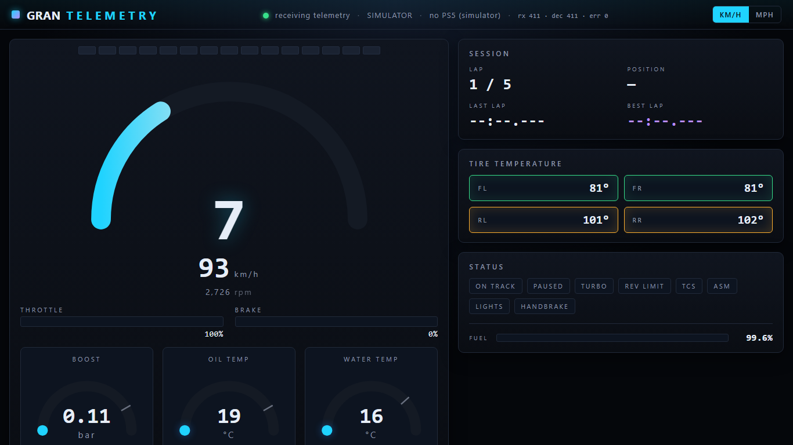

# Gran Turismo 7 Telemetry Dashboard

A web-based telemetry UI for **Gran Turismo 7**, in the spirit of
*EzioDashPro*. It listens to the encrypted UDP telemetry stream that GT7 sends
from a PS5 on the local network, decrypts it with Salsa20, parses the packet,
and streams the values into a live browser dashboard over SignalR.



## Features

- **Live dashboard** in the browser: RPM arc with shift lights, big centered
  gear and speed, clutch/brake/throttle bars, tire temperatures with
  color-coded bands, fuel bar, and lap timing (current, last, best).
- **Ten mini dials**, generated from a single `GAUGE_SPECS` table in
  `dashboard.js`: boost, oil temp, water temp, oil pressure, fuel, incline,
  altitude, cornering load, wheel slip, and ride height. Each has its own
  range, smoothing, colour zones, and greys out to `N/A` when the car does not
  report that value (e.g. boost on a naturally-aspirated car).
- **Status flags**: on-track, paused, turbo, rev-limiter, TCS, ASM, lights,
  handbrake.
- **Unit toggles**: km/h ↔ mph and °C ↔ °F (remembered in `localStorage`).
- **Built-in simulator** — the dashboard works without a PS5. Useful for
  UI development, demoing, or when the console is off.
- **Live UDP** mode with automatic heartbeat, Salsa20 decryption, and
  the Windows-specific `SIO_UDP_CONNRESET` fix so a missing PS5 does not
  kill the receive loop.
- ~30 Hz push to the browser (configurable); the GT7 stream itself is ~60 Hz.
- Standalone smoke-test that round-trips a crafted, encrypted packet through
  the real UDP socket back to the REST endpoint.

## Requirements

- .NET **8.0** SDK (any newer SDK that still bundles the 8.0 runtime works).
- A PS5 on the same network running Gran Turismo 7 *(optional — the built-in
  simulator lets you run the UI without a console).*

## Run it

Simulator mode (default — no console needed):

```powershell
dotnet run --project src\GranTurismoTelemetry.Web
```

Open <http://localhost:5080>.

Live mode against a real PS5:

```powershell
dotnet run --project src\GranTurismoTelemetry.Web `
    --Telemetry:UseSimulator=false `
    --Telemetry:Ps5Ip=192.168.1.42
```

The app sends the required heartbeat to `Ps5Ip:33739` and listens on `:33740`.
Make sure your firewall permits inbound UDP on 33740 for `dotnet.exe`.

## Configuration

Bind under the `Telemetry` section of `appsettings.json` or pass
`--Telemetry:<Key>=<value>` on the command line.

| Key             | Default       | Meaning                                                       |
|-----------------|---------------|---------------------------------------------------------------|
| `Ps5Ip`         | `192.168.1.1` | IP of the PS5 running GT7                                     |
| `SendPort`      | `33739`       | UDP port to send the heartbeat to (on the PS5)                |
| `ReceivePort`   | `33740`       | UDP port to bind locally for the encrypted telemetry stream   |
| `UseSimulator`  | `true`        | If true, ignore the network and generate synthetic telemetry  |
| `BroadcastHz`   | `30`          | Max SignalR push rate to browser clients                      |

## Endpoints

| Path                            | Purpose                                                        |
|---------------------------------|----------------------------------------------------------------|
| `GET /`                         | Dashboard SPA (`wwwroot/index.html`)                           |
| `GET /api/telemetry/status`     | Runtime status + wire-level diagnostics (see below)            |
| `GET /api/telemetry/latest`     | Last decoded packet as JSON (204 if none yet)                  |
| `WS  /hubs/telemetry`           | SignalR hub; clients listen for the `telemetry` event          |

`/api/telemetry/status` returns the current mode, target host/ports, and
these diagnostic counters (updated live):

| Field                  | Meaning                                                              |
|------------------------|----------------------------------------------------------------------|
| `rawPacketsReceived`   | UDP datagrams received on the listen port, valid or not              |
| `decodedPackets`       | Datagrams successfully decrypted (Salsa20) and parsed as GT7 packets |
| `decodeFailures`       | Datagrams that arrived but couldn't be decoded                       |
| `lastPacketAtUtc`      | UTC time of the last successful decode, or null                      |
| `lastRawReceivedAtUtc` | UTC time of the last raw datagram, or null                           |
| `msSinceLastPacket`    | Milliseconds since the last successful decode                        |
| `msSinceLastRaw`       | Milliseconds since the last raw datagram                             |
| `lastDecodeError`      | Human-readable reason for the most recent decode failure             |

## Troubleshooting

*"The dashboard header says **connected** but no telemetry is coming through."*

The **connected** indicator only means the browser reached the server. To
tell whether GT7 packets are actually flowing, the dashboard now shows a
second state:

- 🟢 **receiving telemetry** — packets arriving within the last ~2 s.
- 🟠 **connected — waiting for telemetry** / **no data for N s** — the
  server has no fresh packets. A yellow/red banner appears at the top with
  actionable text driven by `/api/telemetry/status`.

### Diagnose from the counters

Fetch `GET /api/telemetry/status` (also shown as `rx N · dec N · err N` in
the top-right of the header):

| Symptom                                          | Likely cause & fix                                                                                                                                                                                                                                                            |
|--------------------------------------------------|-------------------------------------------------------------------------------------------------------------------------------------------------------------------------------------------------------------------------------------------------------------------------------|
| `rawPacketsReceived: 0`                          | Nothing is reaching UDP `:33740`. Check: **(1)** GT7 is running *and* you're in a car (garage/menus don't stream), **(2)** `--Telemetry:Ps5Ip` matches the PS5's LAN IP, **(3)** Windows Firewall allows *inbound* UDP `:33740` for `dotnet.exe`, **(4)** PS5 and PC are on the same subnet. |
| `rawPacketsReceived > 0`, `decodedPackets: 0`    | Packets are arriving but decryption/parsing fails. Look at `lastDecodeError`. `bad magic … after decrypt` means either the key seed changed in a game patch or another app is sending unrelated traffic to `:33740`.                                                          |
| `decodedPackets > 0` then `msSinceLastPacket` grows | GT7 pauses the stream when you pause / go to menus / leave the car. Get back on track and it resumes.                                                                                                                                                                         |
| Log line `GT7 telemetry stream is live …`        | Everything's fine — appears on the first successful decode.                                                                                                                                                                                                                   |

### Windows Firewall one-liner

Run once as Administrator to open the receive port:

```powershell
New-NetFirewallRule -DisplayName "GT7 Telemetry (UDP 33740)" `
    -Direction Inbound -Protocol UDP -LocalPort 33740 -Action Allow
```

### Enable trace-level UDP logs

If `rawPacketsReceived` stays at 0 and you want to see every heartbeat send
attempt, set the `Gt7UdpClient` category to `Trace` in `appsettings.json`:

```json
"Logging": {
  "LogLevel": {
    "Default": "Information",
    "GranTurismoTelemetry.Web.Gt7.Gt7UdpClient": "Trace"
  }
}
```

## Project layout

```
src/GranTurismoTelemetry.Web/
├── Program.cs                          # Wires SignalR, controllers, static files
├── appsettings.json                    # Default configuration
├── Gt7/
│   ├── Salsa20.cs                      # Pure-C# Salsa20 keystream (20 rounds)
│   ├── Gt7UdpClient.cs                 # UDP receiver + heartbeat + decrypt
│   ├── TelemetryPacket.cs              # Packet fields + parser (296+ bytes)
│   └── TelemetrySimulator.cs           # Fake data source
├── Hubs/TelemetryHub.cs                # SignalR hub (server -> client push)
├── Services/
│   ├── TelemetryOptions.cs             # Bound config
│   └── TelemetryBroadcastService.cs    # BackgroundService gluing source -> hub
├── Controllers/TelemetryController.cs  # Status + latest REST endpoints
└── wwwroot/
    ├── index.html                      # Dashboard layout
    ├── styles.css                      # Dark racing theme
    └── dashboard.js                    # SignalR client, gauges, smoothing

tests/GranTurismoTelemetry.SmokeTest/
└── Program.cs                          # Round-trip encrypted packet -> REST
```

## Verifying the crypto + parser end-to-end

The smoke-test crafts an encrypted GT7 packet (with a chosen IV so the
receiver's Salsa20 nonce matches), pushes it through the parser, and then,
with `--live`, sends the same encrypted packet over UDP to a running app
started in `UseSimulator=false` mode and checks the REST snapshot reflects
the exact values.

```powershell
# In-process test only
dotnet run --project tests\GranTurismoTelemetry.SmokeTest

# In another terminal, start the app in live UDP mode against loopback:
dotnet run --project src\GranTurismoTelemetry.Web `
    --Telemetry:UseSimulator=false --Telemetry:Ps5Ip=127.0.0.1

# Then run the full round-trip test:
dotnet run --project tests\GranTurismoTelemetry.SmokeTest -- --live
```

Expected output:

```
=== GT7 telemetry smoke test ===
OK  in-memory round trip: all fields match
Attempting live UDP round trip to http://localhost:5080 ...
  UDP packet sent to :33740
  server reports: rpm=4200, gear=2, throttle=128
OK  live UDP round trip
```

## Protocol notes

Gran Turismo 7 uses a Salsa20 stream cipher with:

- **Key**: `"Simulator Interface Packet GT7 ver 0.0"` truncated to the first
  32 bytes.
- **Nonce**: read from bytes `0x40..0x44` of the ciphertext; that little-endian
  `uint32` is `xored` with `0xDEADBEAF` to produce the high half of the 8-byte
  nonce, while the original bytes form the low half.
- Plaintext starts with the magic `"G7S0"` at offset 0 (`0x47375330`); packets
  that don't match after decryption are silently dropped.
- Send a single ASCII `'A'` byte to `PS5:33739` to start the stream; keep
  sending it every ~10 s to keep it alive.

## Credits

Protocol details are drawn from the excellent community reverse-engineering
work behind `gt-telem`, `granturismo` (Python) and *EzioDashPro*.
